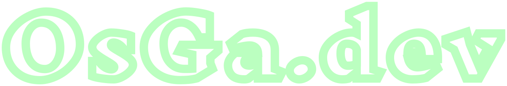
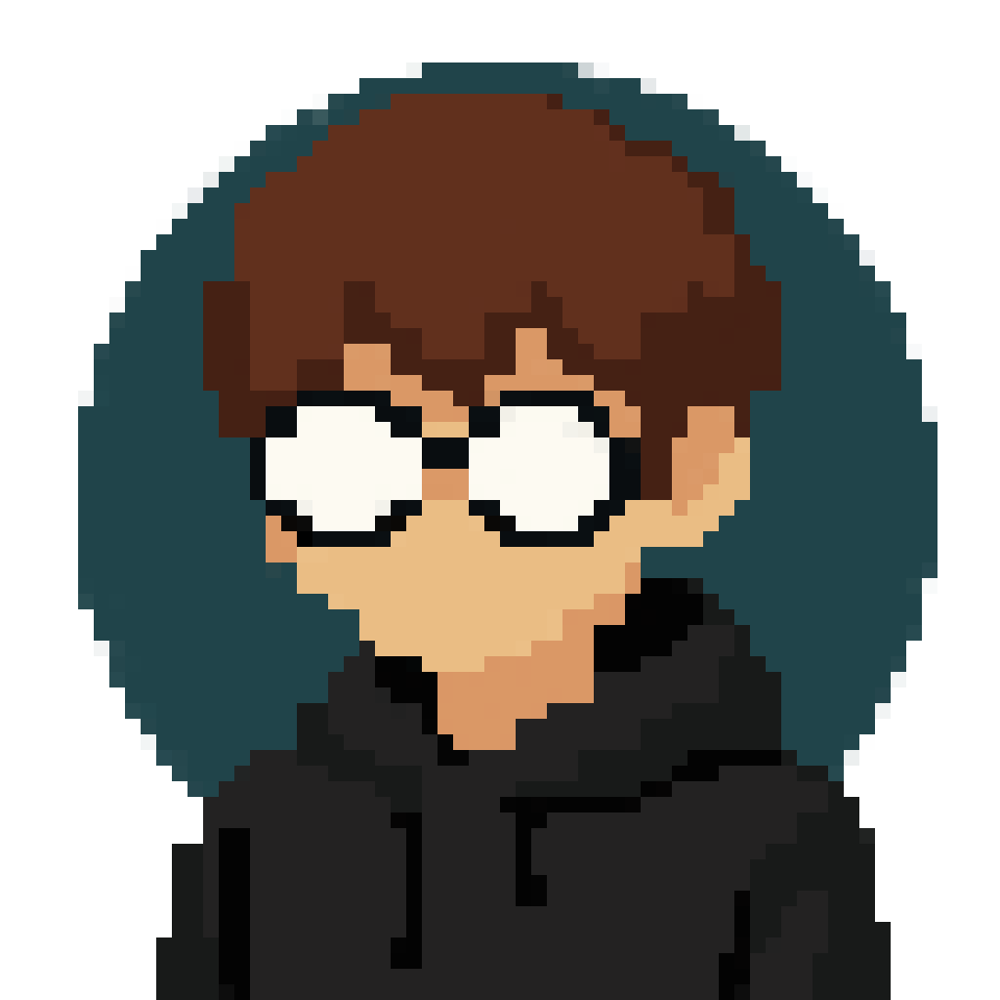
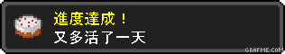

  <h3>Hello    , here is  </h3>

  
    
  `OsGa` or `os24`

## 🤓 About me 

   

  <h3>Alo，我是 OsGa</h3>

  **目前就讀國立雲林科技大學，對資訊相關技能充滿熱情。**

  *我專注於網路安全、程式設計和相關領域，並積极參與資訊社群，經常出沒在一些社群活動及社團營隊。*
  
  > ⬇️你可以在這邊看到關於我的更多資訊⬇️
  
  - 👤 https://osga.dev
  - 📝 https://blog.osga.dev
  - 📩 [me@osga.dev](mailto:me@osga.dev) / [osga@啥.tw](mailto:osga@啥.tw)

  

## 🔨 Tools
> 使用這些助於我日常開發、滲透
> 
> 但基本上 I Use VIM btw

## 💻 Tech Stack
> 我會一點這些，但還有億點不會

    

  <picture>
    <source media="(prefers-color-scheme: dark)" srcset="https://raw.githubusercontent.com/osga24/osga24/output/github-snake-dark.svg" />
    <source media="(prefers-color-scheme: light)" srcset="https://raw.githubusercontent.com/osga24/osga24/output/github-snake.svg" />
     
  </picture>
  

