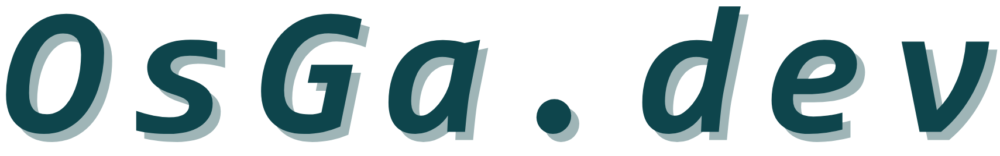

  <h3>Hello    , here is  </h3>

  
    
  `OsGa` or `os24`

## 🤓 About me 

   

  <h3>Alo, I'm OsGa</h3>

  University student at **National Yunlin University of Science and Technology**   with a passion for IT-related skills

  *I'm focus on cybersecurity, programming, and related fields ,  and I'm actively involved in tech communities,  often serving as a speaker at conferences and camps.*
  
  > ⬇︎ See below for more info:
  - 👤 https://osga.dev
  - 📝 https://blog.osga.dev
  - 📩 [me@osga.dev](mailto:me@osga.dev) / [osga@啥.tw](mailto:osga@啥.tw)

## 💻 Tech Stack
> 我會一點這些，但還有億點不會

    

  <picture>
    <source media="(prefers-color-scheme: dark)" srcset="https://raw.githubusercontent.com/osga24/osga24/output/github-snake-dark.svg" />
    <source media="(prefers-color-scheme: light)" srcset="https://raw.githubusercontent.com/osga24/osga24/output/github-snake.svg" />
     
  </picture>
  

